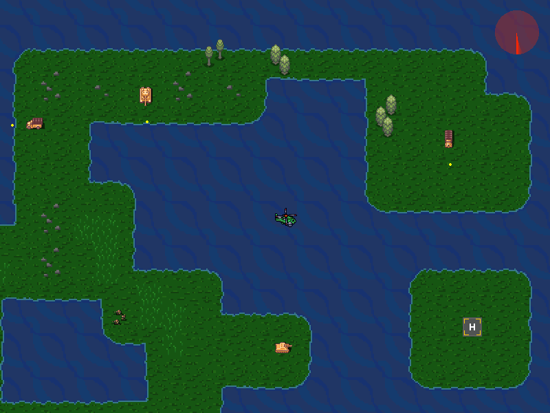
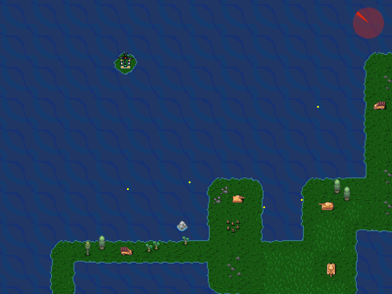
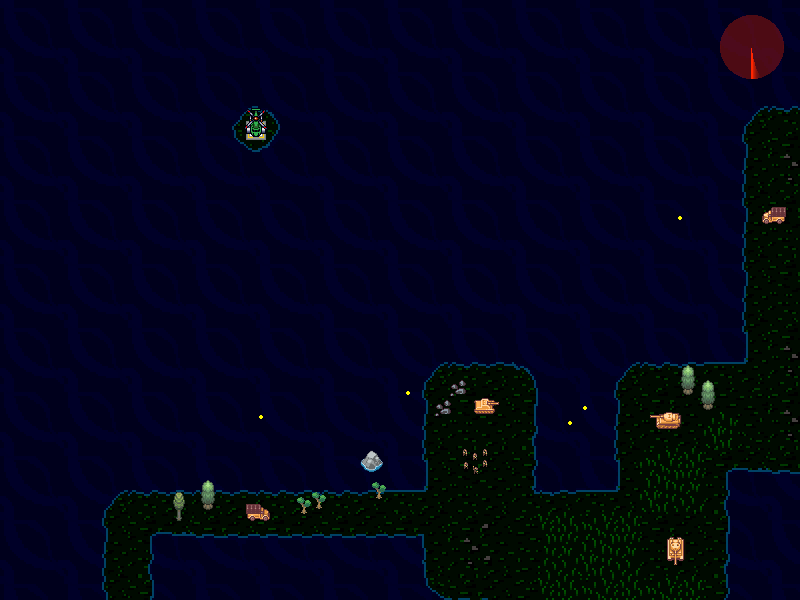

# enjin

Simple 2D game engine with SDL and C++. Based on [Fundamentals of 2D Game Engines with C++ SDL and Lua](https://www.udemy.com/course/cpp-2d-game-engine/).



## Engine

- Entity-Component System
  - ColliderComponent
  - KeyboardControlComponent
  - ProjectileEmitterComponent
  - SpriteComponent
  - TextLabelComponent
  - TileComponent
  - TransformComponent
- Sprite Animation
- AABB Collision Detection
- Fonts
- Textures
- Tilemap

### Prerequisites

**Tested on Ubuntu:**

```bash
sudo apt install libsdl2-dev
sudo apt install libsdl2-image-dev
sudo apt install libsdl2-ttf-dev
sudo apt install libsdl2-mixer-dev
sudo apt install lua5.3
sudo apt install liblua5.3-dev
```

OR

```
sudo apt install libsdl2-dev libsdl2-image-dev libsdl2-ttf-dev libsdl2-mixer-dev lua5.3 liblua5.3-dev
```

### Run Engine

Compile:

```bash
make
```

Run:

```bash
make run
```

Or simply: `make && make run`

## Demo Game

> find save zone to land without getting blown up

### Design your own level with Lua

All assets and entities are loaded dynamically from `assets/scripts/Level1.lua`. This file defines everything inside a level. This way you do not have to recompile the whole engine in order to see changes. Simply restart the game and the script will be loaded again.




